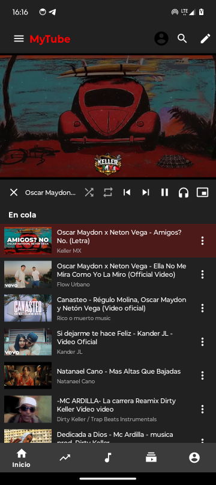
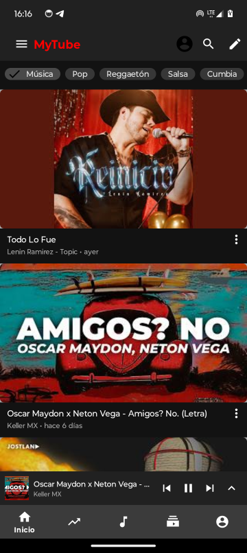
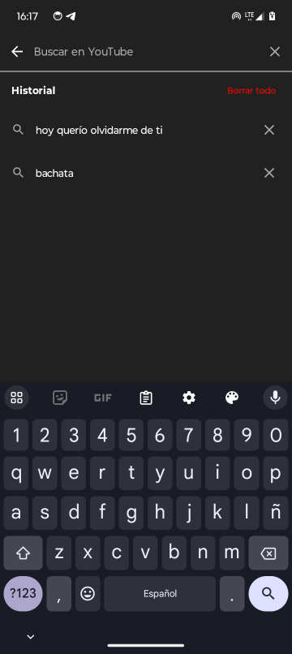

# MyTube

Cliente Android de YouTube orientado a música. Reproducción continua (cola infinita), video visible, búsqueda sin cuotas de API, mini player, segundo plano y picture-in-picture.

<p>
  <a href="https://mytubemusic.vercel.app/"></a>
  <a href="https://github.com/JoseAdolfo19/my-tube/releases/latest"></a>
  <a href="LICENSE"></a>
</p>

**Descarga el APK:** [Último release](https://github.com/JoseAdolfo19/my-tube/releases/latest/download/my-tube.apk) · Android 7.0+ (API 24+)

---

## Características destacadas

- **Catálogo solo música** — el feed, los filtros de género y las búsquedas están limitados a la categoría Música de YouTube.
- **Cola infinita** — al reproducir una canción se cargan 15 similares; cuando quedan 5 se agregan 10 más. Nunca repite y, además, evita repetir el mismo autor seguido y favorece el género seleccionado (ver *Recomendaciones* abajo).
- **Recomendaciones sin repetir** — motor de ranking local (`RecommendationEngine`) que se aplica al feed y a la cola: excluye canciones ya vistas/historial, penaliza el mismo autor que la canción actual y premia el género del chip/búsqueda activos.
- **Video visible** — ExoPlayer renderiza la pista de video (muxed itag 18 o video-only ≤720p) combinada con el audio mediante `MergingMediaSource`.
- **Descargas MP3/MP4** — desde el menú de opciones de cada video se descarga audio (stream de audio, .mp3) o video (formato muxed itag 18, .mp4) a la carpeta Descargas/MyTube con notificación de progreso.
- **Sin dependencia de cuotas** — la búsqueda, el trending y los streams se resuelven directamente con el protocolo **InnerTube** de YouTube (el mismo mecanismo que usan OpenTune/Innertune): no se necesita cuota de Google Cloud para la reproducción principal.
- **Segundo plano** — `PlayerService` en foreground con notificación de MediaSession; mini player y PiP.
- **Búsqueda con historial persistente** — pantalla propia de búsqueda con consultas recientes (borrar, re-ejecutar, re-reproducir).
- **Inicio de sesión opcional con Google** — suscripciones y playlists vía YouTube Data API v3 (requiere tu propia key).
- **Tema claro/oscuro** — tarjetas estilo YouTube con duración, vistas y fecha relativa.
- **Ahorro de datos** — activable en Opciones: reproduce solo audio (sin pista de video) y reduce el prefetch de la cola a un solo siguiente.

## Capturas

| Feed | Reproductor + cola | Mini player | Búsqueda |
|---|---|---|---|
|  |  |  |  |

## Cómo se resuelven los streams (sin el corte de ~1 minuto)

Los clientes antiguos (IOS, WEB_MUSIC) responden HTTP 400 (`Precondition check failed`) o `LOGIN_REQUIRED`. La app prueba la siguiente cascada y se detiene en el primer éxito (ver `StreamResolver.resolveStreamUrl`):

1. `ANDROID` (MOBILE) — funciona; puede requerir visitorData firmado.
2. `ANDROID_VR` — **preferido**: devuelve streams completos sin login; se usa tanto para audio como para video.
3. `ANDROID_MUSIC` / `IOS_MUSIC` — se saltan en tiempo de ejecución cuando YouTube devuelve `LOGIN_REQUIRED`.
4. Fallbacks: proxy de audio local → `StreamProvider` (NewPipeExtractor / Piped).

Cada petición de cliente se firma con `visitorData` propio de la app (descargado de `https://www.youtube.com/sw.js_data`, con URL-decode) y `po_token` opcional (ver `PoTokenGenerator`). Los clientes verificados se cachean por `videoId`; los que fallan entran en un cooldown por video (`markStreamClientFailed`). Las URLs de stream se cachean en memoria hasta `expiresInSeconds`.

Las versiones de perfil de cliente y la API key de InnerTube se actualizan en:
`app/src/main/java/com/miappvideos/api/innertube/YouTubeClient.kt` y `NativeStreamExtractor.kt`.

## Búsqueda sin cuotas

- `InnerTubeSearch.searchVideos()` consulta el cliente **WEB** de YouTube (`twoColumnSearchResultsRenderer` → `videoRenderer`), ~19 resultados por consulta.
- Fallbacks: `YouTubeDataManager` (Data API v3, requiere tu key en `local.properties`) → Piped API.

Se usa desde `MainActivity` (trending + autoplay de "similares") y `SearchActivity`.

## Recomendaciones (qué algoritmo usan OpenTune/YouTube y qué hace MyTube)

El ranking "por preferencias" de YouTube es una red neuronal server-side (candidate generation con embeddings + deep ranking) que **no** se puede replicar en el dispositivo. OpenTune/Innertune y MyTube no la reimplementan: le piden a YouTube sus propios candidatos y después los **filtran y reordenan localmente**:

1. **Candidatos de YouTube** — MyTube usa la búsqueda InnerTube (client WEB) por título+artista y por el género activo; YouTube devuelve canciones ya ordenadas por su similitud musical.
2. **Sin repetición** — se excluyen los `videoId` ya en la cola y en el historial de reproducción, y títulos normalizados duplicados.
3. **Sin mismo autor seguido** — `RecommendationEngine.sameAuthor()` normaliza autores (quita `VEVO`, `Topic`, `Official`, acentos) y penaliza fuerte el autor de la canción actual y los autores recientes; además reordena la lista para que no caigan dos autores iguales consecutivos.
4. **Mismo género** — los chips de género y la búsqueda guardan la categoría activa; `genreFromQuery()` la mapea a `RecommendationEngine.GENRES` y las canciones que coinciden con ese género reciben un bonus de ranking (además de añadir una búsqueda extra del género cuando faltan candidatos).
5. **Calidad musical** — se puntúan los canales oficiales (VEVO/Topic/video oficial) y se penalizan los canales de letras.

Este ranking se aplica en el feed (`loadTrending`) y en la cola (`findSimilarVideos`, `searchNewVideos`).

## Descargas MP3/MP4

Desde el menú ⋮ de un video: **Descargar audio (MP3)** o **Descargar video (MP4)**.

- Resuelve las URLs con `StreamResolver.resolveDownloadStreams()` (misma cascada InnerTube).
- MP3 → stream de audio (prefiere AAC/m4a; el MP3 real requeriría transcodificación con FFmpeg, que no está incluida). Se guarda con extensión `.mp3`.
- MP4 → formato muxed itag 18 (video+audio en un solo archivo `.mp4`). Si el video no lo ofrece, avisa que no está disponible.
- Guarda en `Descargas/MyTube` vía MediaStore (Android 10+) o almacenamiento externo con permiso (Android 9-). El progreso se muestra en una notificación foreground (`DownloadService`).

## Arranque rápido de reproducción

Para llegar a <1,5 s desde el toque hasta el audio (medido ~1,2 s en pruebas):

- La cascada de clientes prueba primero los que funcionan sin login ni `po_token` (`ANDROID_VR`) — los clientes web quedan al final.
- **Sondeo en paralelo**: las 3 variantes de `ANDROID_VR` se consultan a la vez (`resolveStreamUrl`); el arranque no depende de que una sola versión esté bloqueada por anti-bot.
- **Single-flight por videoId**: varias llamadas concurrentes al mismo vídeo (play + preload) comparten una sola resolución, sin duplicar peticiones.
- `visitorData` se precarga al iniciar la app (`StreamResolver.ensureVisitorData()`), no al tocar una canción.
- Las URLs de stream validadas se cachean; al reproducir desde cache no se vuelve a hacer el probe de rango.
- **Probe de rango en paralelo** entre los formatos candidatos y timeouts cortos (conexión 1 s, lectura 2 s) para fallar rápido y pasar al siguiente fallback.
- Timeouts globales: resolución tope 12 s (`withTimeout`), retries 2 con retroceso, `RotatingHttpClient` conexión 4 s / lectura 8 s.
- `ANDROID`/MOBILE queda fuera del camino rápido: YouTube le devuelve formatos pot-gated sin URL directa.

## Arquitectura

```
app/src/main/java/com/miappvideos/
├── MainActivity.kt              # Feed, chips de género, UI del reproductor, cola, autoplay
├── SearchActivity.kt            # Pantalla de búsqueda con historial persistente
├── MiAppVideosApplication.kt    # Init de la app (NewPipeExtractor)
├── api/
│   ├── MusicStreamProvider.kt   # Orquesta audio+video: InnerTube → proxy → StreamProvider
│   ├── StreamProvider.kt        # Cache de streams (NewPipeExtractor)
│   ├── YouTubeDataManager.kt    # YouTube Data API v3 (key opcional)
│   ├── YouTubeApi.kt, PipedApi.kt
│   └── innertube/
│       ├── InnerTubeClient.kt   # POST /player, /search, fetch de visitorData, retries
│       ├── StreamResolver.kt    # Cascada de clientes, selección audio+video, cache
│       ├── InnerTubeSearch.kt   # Parseo del search WEB (videoRenderer)
│       ├── YouTubeClient.kt     # Perfiles de cliente + API key de InnerTube
│       ├── PoTokenGenerator.kt  # Síntesis de po_token (token sintético)
│       └── RotatingHttpClient.kt# OkHttp compartido
├── player/
│   ├── ExoPlayerManager.kt      # Wrapper de ExoPlayer; playAudioVideo() usa MergingMediaSource
│   ├── RangeFixingDataSource.kt # Fix de rangos máx 1 MB para URLs de googlevideo
│   ├── PlayerService.kt         # Segundo plano en foreground + MediaSession
└── auth/LoginActivity.kt        # Inicio de sesión opcional con Google
```

### Flujo de reproducción

```
Tocar un video
  → MusicStreamProvider.getStream(videoId)
      → StreamResolver.resolveStreamUrl(videoId)
          → para cada cliente (ANDROID_VR, ANDROID, ANDROID_MUSIC, IOS_MUSIC):
              POST /player (InnerTube, visitorData firmado [+po_token])
              → parsea adaptiveFormats (audio, mayor bitrate) + video (muxed 18 o video-only ≤720p)
              → valida la URL (estado HTTP), cachea, devuelve ResolvedStream(audioUrl, videoUrl, cliente)
  → ExoPlayerManager.playAudioVideo(audioUrl, videoUrl)
      → MergingMediaSource(audio, video) vía OkHttpDataSource + RangeFixingDataSource
  → Cola: 15 similares precargados; +10 más cuando quedan 5 (InnerTubeSearch)
```

## Compilación

Requisitos: JDK 17+, Android SDK 34.

```bash
# 1. Clona y abre en Android Studio (o CLI):
./gradlew assembleDebug

# 2. (Opcional) Añade tus propias keys en local.properties — NO se commitean:
youtubeApiKey=AIza...            # YouTube Data API v3 (opcional: fallback de búsqueda/suscripciones)
googleSignInClientId=....apps.googleusercontent.com   # (opcional) inicio de sesión con Google

# 3. Instala:
adb install -r app/build/outputs/apk/debug/app-debug.apk
```

> **No se requiere key de Google Cloud** para reproducir ni buscar: la resolución InnerTube y la búsqueda WEB funcionan sin ella. La key de Data API solo alimenta suscripciones/playlists y los fallbacks.

### Build de release firmado

```bash
# Genera un keystore una sola vez (guárdalo — NO está en el repo):
keytool -genkeypair -v -keystore app/keystore/release.jks -alias mytube \
  -keyalg RSA -keysize 2048 -validity 10000 -dname "CN=MyTube"

# Configura las credenciales en key.properties (gitignored) o variables de entorno:
keystorePath=app/keystore/release.jks
keystorePassword=...
keyAlias=mytube
keyPassword=...
# (fallback por entorno: KEYSTORE_PATH, KEYSTORE_PASSWORD, KEY_ALIAS, KEY_PASSWORD)

./gradlew assembleRelease
apksigner verify --verbose --print-certs app/build/outputs/apk/release/app-release.apk
```

## Depuración

- `StreamResolver` loguea la cascada por video: `cliente= status= reason= pot=` y la resolución ganadora `resuelto videoId= cliente= bitrate=` (+ `video=true` cuando se resolvió URL de video).
- `InnerTubeClient` loguea el endpoint → código HTTP + primeros 80 bytes del body (p. ej. `LOGIN_REQUIRED`, `Precondition check failed`, `UNPLAYABLE`).
- Validación en dispositivo: `adb logcat -s StreamResolver:* MusicStreamProvider:*`.

## Inspiración

El motor de reproducción de MyTube está inspirado en **[OpenTune](https://github.com/OpenTuneApp/OpenTune)** (cliente de música de código abierto): de ahí provienen las ideas y el mecanismo base de **InnerTube + po_token + visitorData** que la app usa para resolver streams y búsquedas sin cuotas de API ni cortes de reproducción. A diferencia de OpenTune (solo audio), MyTube además combina la pista de video con `MergingMediaSource`.

## Limitaciones conocidas

- Las versiones de cliente InnerTube caducan; cuando aparezca `Precondition check failed`/`UNPLAYABLE`, actualiza el mapa de versiones en `YouTubeClient.kt`.
- Algunos videos están bloqueados por región (`UNPLAYABLE`) — decide YouTube según video/IP.
- El `po_token` sintético **no** pasa en `WEB_REMIX`; los clientes móviles (ANDROID_VR/ANDROID) funcionan sin él hoy.
- La cola es en memoria (se pierde al reiniciar la app); solo el historial de búsqueda/reproducción es persistente.
- La descarga "MP3" guarda el stream de audio de YouTube (AAC/Opus) con extensión `.mp3`; para MP3 real se necesitaría FFmpeg.
- La calidad del video visible depende de la red; con el ahorro de datos activo se reproduce solo audio.

## Pendiente: error 10 en inicio de sesión con Google

El login con Google falla con **Error 10 (DEVELOPER_ERROR)** en el APK release. Causa probable: el SHA-1 de la firma del release no está registrado en Google Cloud Console.

**Para mañana:**

1. Obtener el SHA-1 de la firma de producción:
   ```bash
   keytool -list -v -keystore app/keystore/release.jks -alias mytube -storepass <pass>
   # SHA1: 91:7D:A5:CF:14:D2:AA:88:A1:78:F0:A3:13:C9:4B:73:F1:E5:AF:23
   ```
2. En [Google Cloud Console](https://console.cloud.google.com/apis/credentials) → Credenciales → el OAuth Client ID de Android (`com.miappvideos`): añadir el SHA-1 anterior (o crear un client ID nuevo con él).
3. Si se crea un client ID nuevo, actualizar `googleSignInClientId` en `local.properties` (y `strings.xml`/manifest si se referencia ahí) y recompilar el release.
4. Reinstalar y probar el login.

Nota: el login funcionaba en debug porque el SHA-1 del keystore de depuración de Android Studio sí está registrado; el keystore de release (`app/keystore/release.jks`) es distinto.

## Licencia

[GPL-3.0](LICENSE). No afiliado con Google ni YouTube.
